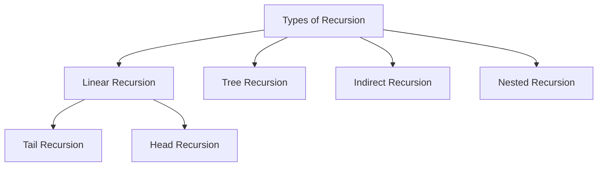

<div align="center">

# 🔁 00 · Recursion

### Mathematical Induction · Call Stack Tracing · Types of Recursion · Recurrence Relations


_to_O(2^n)-blueviolet?style=for-the-badge)

*An exhaustive exploration of recursive mechanics, calling vs returning phases, tree execution, memoization, and classical algorithmic problems.*

</div>

---

## 📖 Theoretical Foundations

Recursion is a problem-solving technique where a function solves a smaller sub-instance of the same problem by calling itself until it reaches a terminating **Base Condition**.

### Anatomy of a Recursive Function
A recursive call lifecycle consists of two distinct phases:
1. **Calling Phase (Ascending)**: Statements executed *before* the recursive call as the stack frames are being pushed.
2. **Returning Phase (Descending)**: Statements executed *after* the recursive call as the function calls return and stack frames are popped.

```text
void fun(int n) {
    if (n > 0) {
        // --- 1. CALLING PHASE (Ascending) ---
        cout << n << " ";
        
        fun(n - 1); // Recursive Call
        
        // --- 2. RETURNING PHASE (Descending) ---
        // Any operations placed here execute on unwind
    }
}
```

---

## 🗂️ Directory Structure

```text
00_recursion/
├── 01_TailHead/
│   ├── func1.cpp                 # Ascending (calling phase) execution
│   └── func2.cpp                 # Descending (returning phase) execution
├── 02_StaticGlobal/
│   ├── normal.cpp                # Local variable behavior (independent activation records)
│   ├── static.cpp                # Static variable persistence across recursive calls
│   └── global.cpp                # Global variable persistence in recursion
├── 03_Tail/
│   └── main.cpp                  # Pure Tail Recursion (last operation is recursive call)
├── 04_Head/
│   └── main.cpp                  # Pure Head Recursion (all processing occurs in returning phase)
├── 05_Tree/
│   └── main.cpp                  # Tree Recursion (function calls itself more than once: O(2^n))
├── 06_IndirectRecursion/
│   └── main.cpp                  # Circular recursion (funA() -> funB() -> funA())
├── 07_NestedRecursion/
│   └── main.cpp                  # Nested Recursion (recursion parameter is itself a recursive call)
│
├── Examples/
│   ├── 01_sumOfNaturals/         # Sum of first N natural numbers: O(n)
│   ├── 02_factorial/             # Factorial calculation: n! = n * (n-1)!
│   ├── 03_exponent/              # Exponentiation: naive O(n) vs fast power O(log n)
│   ├── 04_taylor/                # Taylor series for e^x (standard, static variables, Horner's Rule)
│   ├── 05_fibonacci/             # Fibonacci: Iterative O(n), Naive O(2^n), Memoized O(n)
│   ├── 06_combination/           # Combination (nCr): Factorial formula vs Pascal's Identity
│   └── 07_towerOfHanoi/          # Tower of Hanoi problem (2^n - 1 moves)
│
└── Quiz 1/
    ├── q1.cpp                    # Tracing recursive loop outputs
    ├── q2.cpp                    # Tracing static variables inside recursion
    ├── q3.cpp                    # Tracing nested tree recursion
    ├── q4.cpp                    # Tracing double-call return values
    └── q5.cpp                    # Recursive return arithmetic
```

---

## 🔬 Classification of Recursion



| Type | Description | Space Complexity | Time Complexity | Loop Conversion |
| :--- | :--- | :---: | :---: | :--- |
| **Tail Recursion** | The recursive call is the last statement executed. No operations pending on return. | $O(n)$ | $O(n)$ | Easily converted to `while` loop with $O(1)$ space. |
| **Head Recursion** | The recursive call is the first statement; all processing occurs during return. | $O(n)$ | $O(n)$ | Converted to loop by reversing logic or using an explicit stack. |
| **Tree Recursion** | Function makes two or more recursive calls per invocation. | $O(n)$ | $O(2^n)$ | Requires explicit stack / queue for iteration. |
| **Indirect Recursion**| Function $A$ calls $B$, and $B$ calls $A$ in a circular chain. | $O(n)$ | $O(n)$ | State-machine or mutual looping. |
| **Nested Recursion** | Recursive call is passed as an argument to another recursive call: `fun(fun(n+11))`. | $O(n)$ | Dependent on function | McCarthy 91 function style. |

---

## 🧪 Classical Algorithms & Implementation Notes

### 1. Fast Exponentiation (`03_exponent`)
- **Naive Recursion**: $m^n = m \times m^{n-1} \implies O(n)$ time.
- **Optimized Fast Power**:
  $$m^n = \begin{cases} (m^2)^{n/2} & \text{if } n \text{ is even} \\ m \times (m^2)^{(n-1)/2} & \text{if } n \text{ is odd} \end{cases}$$
  **Time Complexity**: $O(\log n)$ · **Space Complexity**: $O(\log n)$

### 2. Taylor Series for $e^x$ (`04_taylor`)
$$e^x = 1 + \frac{x}{1!} + \frac{x^2}{2!} + \frac{x^3}{3!} + \dots + \frac{x^n}{n!}$$
- **Standard Recursion**: Uses static variables `p` (power) and `f` (factorial) in $O(n^2)$ operations.
- **Horner's Rule**: Factors terms to reduce multiplications to $O(n)$:
  $$e^x = 1 + \frac{x}{1} \left( 1 + \frac{x}{2} \left( 1 + \frac{x}{3} \left( \dots \left( 1 + \frac{x}{n} \right) \dots \right) \right) \right)$$

### 3. Fibonacci Sequence & Memoization (`05_fibonacci`)
- **Naive Recursive**: Excess duplicate calculations leading to $O(2^n)$ time.
- **Memoized (Top-Down Dynamic Programming)**: Storing previously computed Fibonacci terms in an auxiliary lookup table array (`F[10] = {-1}`) reduces time complexity from $O(2^n)$ down to **$O(n)$**.

### 4. Combinations $nCr$ (`06_combination`)
- **Formula Approach**: Uses $nCr = \frac{n!}{r!(n-r)!}$ (risk of integer overflow for large factorials).
- **Pascal's Identity (Recursive)**:
  $$nCr = {n-1 \choose r-1} + {n-1 \choose r}$$
  Base cases: if $r == 0$ or $r == n$, return $1$.

### 5. Tower of Hanoi (`07_towerOfHanoi`)
- Moving $n$ disks from Source peg $A$ to Destination peg $C$ using Auxiliary peg $B$:
  1. Move $n-1$ disks from $A$ to $B$ using $C$.
  2. Move disk $n$ from $A$ to $C$.
  3. Move $n-1$ disks from $B$ to $C$ using $A$.
- **Total Moves**: $2^n - 1$ moves.
- **Time Complexity**: $O(2^n)$ · **Space Complexity**: $O(n)$ call stack depth.

---

## 📊 Summary of Examples Complexity

| Problem | Approach | Time Complexity | Space Complexity |
| :--- | :--- | :---: | :---: |
| **Sum of Natural Numbers** | Recursive | $O(n)$ | $O(n)$ |
| **Factorial** | Recursive | $O(n)$ | $O(n)$ |
| **Exponent $m^n$** | Fast Exponentiation | $O(\log n)$ | $O(\log n)$ |
| **Taylor Series ($e^x$)** | Horner's Rule | $O(n)$ | $O(n)$ |
| **Fibonacci** | Memoization | $O(n)$ | $O(n)$ |
| **Combination ($nCr$)** | Pascal's Triangle | $O(2^n)$ | $O(n)$ |
| **Tower of Hanoi** | 3-Peg Recursive | $O(2^n)$ | $O(n)$ |

---

## ⚙️ Compilation & Testing

Compile and execute any example or quiz file:

```bash
# Example: Run Tower of Hanoi
clang++ -std=c++17 Examples/07_towerOfHanoi/main.cpp -o hanoi
./hanoi

# Example: Run Memoized Fibonacci
clang++ -std=c++17 Examples/05_fibonacci/optimized.cpp -o fib_opt
./fib_opt
```

---

## 🔗 Related Sections

- 🔙 [Data Structures Overview](../README.md)
- ➡️ [01 · Array Representation](../01_arraysRepresentation/README.md)
- ➡️ [02 · Array ADT](../02_arrayADT/README.md)
