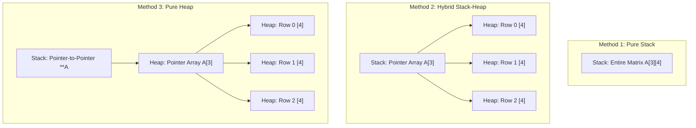

<div align="center">

# 📐 01 · Array Representation & Addressing Formulas

### Physical & Logical Memory Mapping · Heap Allocation · Multidimensional Arrays · Index Formulas


*An in-depth study of how arrays are stored in memory, static vs dynamic arrays, resizing dynamics, 2D array memory allocations, and n-dimensional address calculation formulas.*

</div>

---

## 📖 Core Concepts

An **Array** is a contiguous block of memory holding homogenous elements referenced by index. While programs view multidimensional arrays as grids or hypercubes, computer hardware memory is strictly linear (1-Dimensional). The compiler uses mathematical addressing formulas to map multi-dimensional coordinates directly to physical byte addresses in $O(1)$ time.

---

## 🗂️ Directory Structure

```text
01_arraysRepresentation/
├── 00_declaration/
│   └── main.cpp                  # Array declaration, definition, and initialization styles
├── 01_staticDynamic/
│   └── main.cpp                  # Stack allocation vs Dynamic Heap allocation (new / delete)
├── 02_arraySizeIncrement/
│   └── main.cpp                  # Increasing array capacity by pointer redirection & deallocation
├── 03_2DimensionalArray/
│   ├── method1.cpp               # Method 1: Pure stack allocation (int A[3][4])
│   ├── method2.cpp               # Method 2: Stack array of pointers to heap rows (int *A[3])
│   └── method3.cpp               # Method 3: Double pointer heap allocation (int **A)
├── 04_1DarrayIndexFormula/
│   └── notes.txt                 # Address calculation for 1D arrays
├── 05_2DarrayIndexFormula/
│   ├── rowMajor/                 # Row-Major mapping formula & notes
│   ├── columnMajor/              # Column-Major mapping formula & notes
│   └── notes.txt                 # Comparison between Row-Major and Column-Major
├── 06_nDarrayIndexFormula/       # General n-Dimensional formulas and Horner's Rule optimization
├── 07_3DarrayIndexFormula/       # 3D Array addressing derivation
└── Quiz 2/
    ├── ques1/                    # Addressing calculation problem 1
    ├── ques2/                    # Array pointer arithmetic problem 2
    ├── ques3/                    # Multi-dimensional bounds problem 3
    └── ques4/                    # 2D array indexing calculation problem 4
```

---

## 💾 Array Memory Allocation Models

### 1. Static (Stack) vs Dynamic (Heap) Arrays (`01_staticDynamic`)
- **Static Array (`int A[5]`)**: Allocated inside the function's Stack frame at compile/runtime. Deallocated automatically upon scope exit. Size cannot be modified.
- **Dynamic Array (`int *p = new int[5]`)**: Pointer `p` resides in the Stack, pointing to a contiguous memory block on the Heap. Must be explicitly freed with `delete[] p` to avoid memory leaks.

### 2. Resizing an Array Dynamically (`02_arraySizeIncrement`)
Arrays in contiguous memory cannot simply expand in place. Resizing requires:
1. Allocating a new, larger array on the Heap (`int *q = new int[new_size]`).
2. Copying elements from the old array into the new array.
3. Deallocating the old array (`delete[] p`).
4. Pointing the original pointer to the new memory block (`p = q; q = nullptr`).

### 3. 2D Array Memory Representations (`03_2DimensionalArray`)



---

## 📐 Addressing Formulas (Index to Memory Address)

Let:
- $L_0$ = Base Address (address of the first element).
- $w$ = Element size in bytes (`sizeof(dataType)`).
- Indices are $0$-indexed (or lower bound $l$, upper bound $u$).

### 1. 1-Dimensional Array
$$Address(A[i]) = L_0 + i \times w$$
For arbitrary lower bound $l$:
$$Address(A[i]) = L_0 + (i - l) \times w$$

---

### 2. 2-Dimensional Array ($m \times n$ Matrix)
For an array $A[m][n]$ with row range $0 \le i < m$ and column range $0 \le j < n$:

#### A. Row-Major Order (Used in C / C++ / Python)
Elements are stored row-by-row linearly in memory.
$$Address(A[i][j]) = L_0 + [i \times n + j] \times w$$
With arbitrary bounds $[l_1 \dots u_1] \times [l_2 \dots u_2]$ (where $n = u_2 - l_2 + 1$):
$$Address(A[i][j]) = L_0 + [(i - l_1) \times n + (j - l_2)] \times w$$

#### B. Column-Major Order (Used in Fortran / MATLAB / R)
Elements are stored column-by-column linearly in memory.
$$Address(A[i][j]) = L_0 + [j \times m + i] \times w$$
With arbitrary bounds $[l_1 \dots u_1] \times [l_2 \dots u_2]$ (where $m = u_1 - l_1 + 1$):
$$Address(A[i][j]) = L_0 + [(j - l_2) \times m + (i - l_1)] \times w$$

---

### 3. 3-Dimensional Array ($d_1 \times d_2 \times d_3$)
For $A[i][j][k]$:
- **Row-Major Order**:
  $$Address(A[i][j][k]) = L_0 + [i \times d_2 \times d_3 + j \times d_3 + k] \times w$$
- **Column-Major Order**:
  $$Address(A[i][j][k]) = L_0 + [k \times d_1 \times d_2 + j \times d_1 + i] \times w$$

---

### 4. General n-Dimensional Array & Horner's Rule (`06_nDarrayIndexFormula`)
For an $n$-dimensional array $A[d_1][d_2]\dots[d_n]$ with index $(i_1, i_2, \dots, i_n)$:
- **Standard Formula**:
  $$Address = L_0 + \left( \sum_{k=1}^n i_k \prod_{j=k+1}^n d_j \right) \times w$$
  Computing this directly requires $O(n^2)$ multiplication operations.
- **Horner's Rule Optimization**:
  $$Address = L_0 + \left( ((\dots((i_1 d_2 + i_2)d_3 + i_3)\dots)d_n + i_n) \right) \times w$$
  This factors common terms and evaluates in **$O(n)$ multiplications**, significantly speeding up address resolution at runtime.

---

## ⚙️ Compilation & Testing

```bash
# Example: 2D Array Representations
clang++ -std=c++17 03_2DimensionalArray/method3.cpp -o method3
./method3

# Example: Dynamic Resizing
clang++ -std=c++17 02_arraySizeIncrement/main.cpp -o resize
./resize
```

---

## 🔗 Related Sections

- 🔙 [Data Structures Overview](../README.md)
- ⬅️ [00 · Recursion](../00_recursion/README.md)
- ➡️ [02 · Array ADT](../02_arrayADT/README.md)
