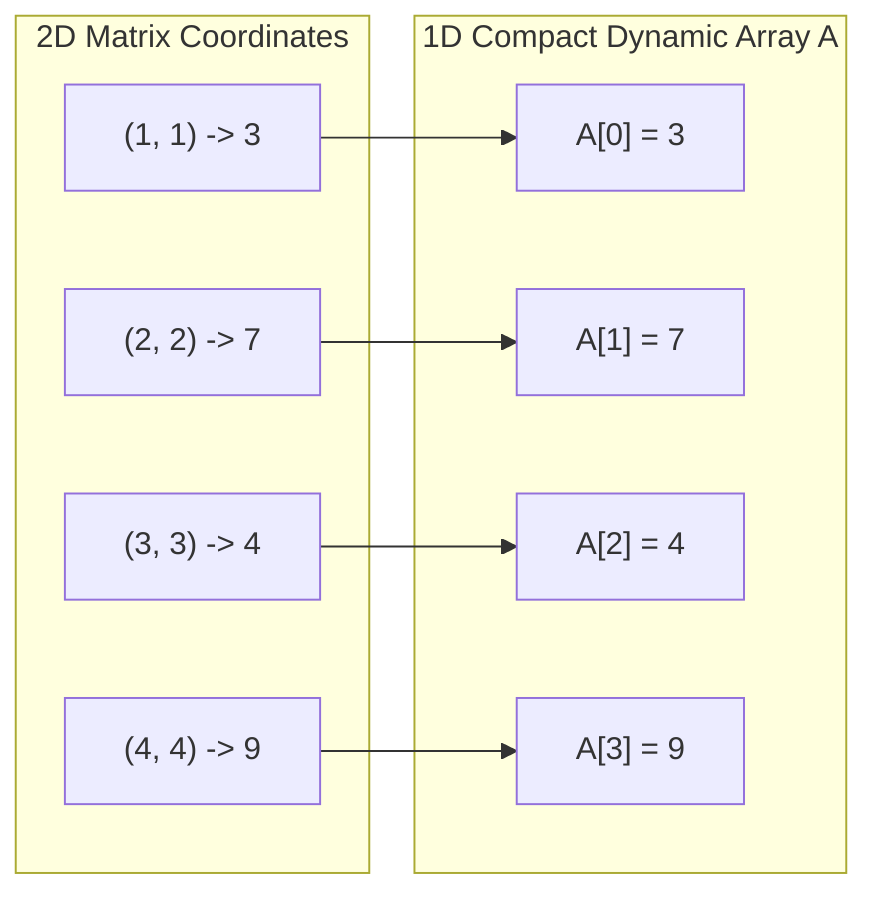

<div align="center">

# 🔲 04 · Special Matrices & Compact Array Representations

### Square Matrix Optimization · 1D Linear Mapping · Coordinate Addressing · C++


*Optimizing square matrix memory footprints in C++ by mapping structured zero and redundant elements into compact 1-Dimensional dynamic arrays via $O(1)$ index translation formulas.*

</div>

---

## 📖 Core Concepts

A **Square Matrix** ($n \times n$) in standard representation requires $O(n^2)$ contiguous space. However, in many scientific and mathematical applications, matrices exhibit structural symmetry, band restrictions, or sparse non-zero distributions. 

By taking advantage of these properties, we eliminate the need to store default zeroes or duplicates:
1. **Space Optimization**: Compressing $n \times n$ grids into compact 1D arrays saves significant RAM (e.g., $O(n)$ space for diagonal matrices, $\approx n^2/2$ space for triangular matrices).
2. **Mathematical Coordinate Mapping**: We derive direct $O(1)$ formulas that translate 2D matrix coordinates $(i, j)$ into a 1D array index `A[k]`.
3. **C++ Class Encapsulation (ADT)**: Encapsulating the raw 1D array inside a `DiagonalMatrix` or `LowerTriangularMatrix` class provides seamless `get(i, j)`, `set(i, j, x)`, and `display()` interfaces while keeping memory compression hidden from the caller.

---

## 🗂️ Directory Structure

```text
04_matrices/
├── 01_diagonal_matrix/              # ✅ Completed: Diagonal Matrix 1D mapping & C++ ADT
│   ├── diagonal_matrix.cpp          # Full C++ DiagonalMatrix class implementation & driver
│   └── notes.txt                    # Formulas, complexity analysis, and properties
├── 02_lower_triangular_matrix/      # ✅ Completed: Lower Triangular Matrix (Row & Column Major)
│   ├── 01_row_major/                # Row-Major mapping implementation & driver
│   │   ├── lower_triangular_matrix.cpp
│   │   └── image.png
│   ├── 02_column_major/             # Column-Major mapping implementation & driver
│   │   ├── lower_triangular_matrix.cpp
│   │   └── image.png
│   └── notes.txt                    # Addressing formula notes (1-based & 0-based)
├── 03_upper_triangular_matrix/      # ✅ Completed: Upper Triangular Matrix (Row & Column Major)
│   ├── 01_row_major/                # Row-Major mapping implementation & driver
│   │   └── upper_triangular_matrix.cpp
│   ├── 02_column_major/             # Column-Major mapping implementation & driver
│   │   └── upper_triangular_matrix.cpp
│   └── notes.txt                    # Addressing formula notes (1-based & 0-based)
├── 04_symmetric_matrix/             # ✅ Completed: Symmetric Matrix (Lower Triangular mapping)
│   ├── symmetric_matrix.cpp         # Full C++ SymmetricMatrix class implementation & driver
│   └── notes.txt                    # Mapping reduction to Triangular Matrix & symmetry swap
├── 05_tridiagonal_matrix/           # ✅ Completed: Tridiagonal Matrix (Main, lower, and upper diagonals)
│   ├── tridiagonal_matrix.cpp       # Full C++ TridiagonalMatrix class implementation & driver
│   └── notes.txt                    # 3n - 2 elements mapping formulas (1-based & 0-based)
├── 06_band_matrix/                  # ⏳ Band Matrix (Arbitrary bandwidth k around diagonal)
│   ├── band_matrix.cpp              # C++ template
│   └── notes.txt                    # Bandwidth indexing notes
├── 07_toeplitz_matrix/              # ⏳ Toeplitz Matrix (Identical descending diagonals)
│   ├── toeplitz_matrix.cpp          # C++ template
│   └── notes.txt                    # 2n - 1 unique elements mapping
├── 08_sparse_matrix/                # ⏳ Sparse Matrix (3-column representation & addition)
│   ├── sparse_matrix.cpp            # C++ template
│   └── notes.txt                    # Coordinate list / CSR concepts
├── notes.txt                        # Master overview of Special Square Matrices
└── README.md                        # Matrices module documentation and progress tracker
```

---

## 📊 Special Matrices Progress Tracker

| # | Matrix Type | Condition ($A[i][j] = 0$) | Non-Zero Elements | 1D Array Size | Status |
| :-: | :--- | :--- | :-: | :-: | :-: |
| **01** | **Diagonal Matrix** | $i \neq j$ | $n$ | $n$ | ✅ **Completed** |
| **02** | **Lower Triangular Matrix** | $i < j$ | $\frac{n(n + 1)}{2}$ | $\frac{n(n + 1)}{2}$ | ✅ **Completed** |
| **03** | **Upper Triangular Matrix** | $i > j$ | $\frac{n(n + 1)}{2}$ | $\frac{n(n + 1)}{2}$ | ✅ **Completed** |
| **04** | **Symmetric Matrix** | $A[i][j] = A[j][i]$ | $\frac{n(n + 1)}{2}$ unique | $\frac{n(n + 1)}{2}$ | ✅ **Completed** |
| **05** | **Tridiagonal Matrix** | $\|i - j\| > 1$ | $3n - 2$ | $3n - 2$ | ✅ **Completed** |
| **06** | **Band Matrix** | $\|i - j\| > k$ | $(2k + 1)n - k(k + 1)$ | Band size | ⏳ Planned |
| **07** | **Toeplitz Matrix** | $A[i][j] = A[i-1][j-1]$ | $2n - 1$ unique | $2n - 1$ | ⏳ Planned |
| **08** | **Sparse Matrix** | Majority elements $= 0$ | $m \ll n^2$ | $3 \times (m + 1)$ | ⏳ Planned |

---

## 📚 Module Breakdown & Key Implementations

### 1. Diagonal Matrix (`01_diagonal_matrix`) ✅

#### Mathematical Definition
A square matrix $M$ of dimension $n \times n$ where all off-diagonal elements are zero:

$$M[i][j] = \begin{cases} x & \text{if } i = j \\ 0 & \text{if } i \neq j \end{cases}$$

```text
Example (4x4 Diagonal Matrix):
[ 3   0   0   0 ]
[ 0   7   0   0 ]
[ 0   0   4   0 ]
[ 0   0   0   9 ]
```

#### 1D Linear Memory Mapping
Instead of consuming $n \times n = n^2$ integers, we store only the $n$ diagonal elements in a dynamically allocated 1D array `A`:



- **Addressing Formula (1-based $i, j$ to 0-based array index)**:
  $$\text{Index}(i, j) = i - 1 \quad (\text{when } i = j)$$
  If $i \neq j$, the value is implicitly $0$ without reading from memory.

#### Complexity Analysis
- **Space Complexity**: $O(n)$ heap allocation (down from $O(n^2)$).
- **Time Complexity**:
  - `set(i, j, x)`: $O(1)$
  - `get(i, j)`: $O(1)$
  - `display()`: $O(n^2)$ to render full 2D grid

#### C++ Implementation Summary
```cpp
class DiagonalMatrix {
private:
    int *A;
    int dimension;

public:
    DiagonalMatrix(int dimension) {
        this->dimension = dimension;
        this->A = new int[dimension](); // Zero-initialized
    }

    ~DiagonalMatrix() {
        delete[] A;
        A = nullptr;
    }

    void set(int i, int j, int x) {
        if (i == j) {
            A[i - 1] = x;
        }
    }

    int get(int i, int j) {
        if (i == j) {
            return A[i - 1];
        }
        return 0;
    }

    void display() {
        for (int i = 0; i < dimension; i++) {
            for (int j = 0; j < dimension; j++) {
                cout << "\t";
                if (i == j) cout << A[i];
                else cout << "0";
                cout << " ";
            }
            cout << "\n";
        }
    }
};
```

---

### 2. Lower Triangular Matrix (`02_lower_triangular_matrix`) ✅

#### Mathematical Definition
A square matrix $M$ of dimension $n \times n$ where all elements strictly above the main diagonal are zero:

$$M[i][j] = \begin{cases} \text{non-zero / arbitrary} & \text{if } i \ge j \\ 0 & \text{if } i < j \end{cases}$$

```text
Example (4x4 Lower Triangular Matrix):
[ a11   0    0    0  ]
[ a21  a22   0    0  ]
[ a31  a32  a33   0  ]
[ a41  a42  a43  a44 ]
```

- **Non-Zero Elements Count**: $1 + 2 + 3 + \dots + n = \frac{n(n + 1)}{2}$
- **Zero Elements Count**: $n^2 - \frac{n(n + 1)}{2} = \frac{n(n - 1)}{2}$
- **Compact 1D Array Size**: $\frac{n(n + 1)}{2}$

#### Linear Coordinate Mapping Schemes

Both implementations use 1-based matrix coordinates $(i, j)$ mapped to a 0-based compact dynamic array `A`:

##### A. Row-Major Order (`01_row_major`)
Elements are mapped and stored row-by-row:
- Row 1 has 1 element: $a_{11}$
- Row 2 has 2 elements: $a_{21}, a_{22}$
- Row $i-1$ has $i-1$ elements.
- Number of elements in preceding $i-1$ rows:
  $$\sum_{k=1}^{i-1} k = \frac{i(i - 1)}{2}$$
- Within row $i$, column $j$ has 0-based offset $j - 1$.

$$\mathbf{\text{Index}}(i, j) = \frac{i(i - 1)}{2} + (j - 1) \quad (\text{for } 1 \le j \le i \le n)$$

*(Note: For 0-based matrix indexing $0 \le j \le i < n$, the formula is $\frac{i(i + 1)}{2} + j$)*

##### B. Column-Major Order (`02_column_major`)
Elements are mapped and stored column-by-column:
- Column 1 has $n$ elements: $a_{11}, a_{21}, \dots, a_{n1}$
- Column 2 has $n - 1$ elements: $a_{22}, a_{32}, \dots, a_{n2}$
- Column $j-1$ has $n - (j - 2)$ elements.
- Total elements in all preceding $j-1$ columns:
  $$\sum_{k=1}^{j-1} (n - k + 1) = \frac{n(n + 1)}{2} - \frac{(n - j + 1)(n - j + 2)}{2} = n(j - 1) - \frac{(j - 2)(j - 1)}{2}$$
- Within column $j$, elements begin at row $j$, giving row offset $i - j$.

$$\mathbf{\text{Index}}(i, j) = \left[\frac{n(n + 1)}{2} - \frac{(n - j + 1)(n - j + 2)}{2}\right] + (i - j) \quad (\text{for } 1 \le j \le i \le n)$$

*(Note: For 0-based matrix indexing $0 \le j \le i < n$, the formula is $\left[n \cdot j - \frac{j(j - 1)}{2}\right] + (i - j)$)*

#### Complexity Analysis
- **Space Complexity**: $O\left(\frac{n(n + 1)}{2}\right) \approx O\left(\frac{n^2}{2}\right) \to O(n^2)$ heap allocation (~50% memory savings).
- **Time Complexity**:
  - `set(i, j, value)`: $O(1)$
  - `get(i, j)`: $O(1)$
  - `display()`: $O(n^2)$ to render full 2D view

#### C++ Implementation Summary (`LowerTriangularMatrix`)
```cpp
class LowerTriangularMatrix {
private:
    int n;
    int *A;

public:
    LowerTriangularMatrix(int n) {
        this->n = n;
        A = new int[n * (n + 1) / 2](); // Zero-initialized compact 1D array
    }

    ~LowerTriangularMatrix() {
        delete[] A;
        A = nullptr;
    }

    // Row-Major mapping
    void set(int i, int j, int value) {
        if (i >= j) {
            A[(i * (i - 1) / 2) + (j - 1)] = value;
        }
    }

    int get(int i, int j) {
        if (i >= j) {
            return A[(i * (i - 1) / 2) + (j - 1)];
        }
        return 0;
    }

    void display() {
        for (int i = 1; i <= n; i++) {
            for (int j = 1; j <= n; j++) {
                cout << '\t';
                if (i >= j) cout << A[(i * (i - 1) / 2) + (j - 1)];
                else cout << '0';
                cout << ' ';
            }
            cout << '\n';
        }
    }
};
```

---

### 3. Upper Triangular Matrix (`03_upper_triangular_matrix`) ✅

#### Mathematical Definition
A square matrix $M$ of dimension $n \times n$ where all elements strictly below the main diagonal are zero:

$$M[i][j] = \begin{cases} \text{non-zero / arbitrary} & \text{if } i \le j \\ 0 & \text{if } i > j \end{cases}$$

```text
Example (4x4 Upper Triangular Matrix):
[ a11  a12  a13  a14 ]
[  0   a22  a23  a24 ]
[  0    0   a33  a34 ]
[  0    0    0   a44 ]
```

- **Non-Zero Elements Count**: $n + (n - 1) + \dots + 1 = \frac{n(n + 1)}{2}$
- **Zero Elements Count**: $n^2 - \frac{n(n + 1)}{2} = \frac{n(n - 1)}{2}$
- **Compact 1D Array Size**: $\frac{n(n + 1)}{2}$

---

### 🔄 The Duality Principle: Interchange of Indices ($i \leftrightarrow j$)

> [!TIP]
> **Key Insight: Transposition Duality ($U = L^T$)**
>
> Because an upper triangular matrix $U$ is mathematically the transpose of a lower triangular matrix $L$ ($U = L^T$), swapping row and column indices ($i \leftrightarrow j$) directly transforms lower triangular addressing formulas into upper triangular formulas!
>
> - **Row-Major of $L$** corresponds to **Column-Major of $U$** (swap $i \leftrightarrow j$).
> - **Column-Major of $L$** corresponds to **Row-Major of $U$** (swap $i \leftrightarrow j$).

#### Summary Comparison Table (1-Based Matrix Coordinates)

| Property / Order | Lower Triangular Matrix ($L$) | Upper Triangular Matrix ($U$) | Index Transformation |
| :--- | :--- | :--- | :---: |
| **Non-Zero Condition** | $i \ge j$ | $i \le j$ *(i.e., $j \ge i$)* | $i \leftrightarrow j$ |
| **Row-Major Order** | $\mathbf{\text{Index}} = \left[\frac{\mathbf{i}(\mathbf{i} - 1)}{2}\right] + (\mathbf{j} - 1)$ | $\mathbf{\text{Index}} = \left[\frac{n(n + 1)}{2} - \frac{(n - \mathbf{i} + 1)(n - \mathbf{i} + 2)}{2}\right] + (\mathbf{j} - \mathbf{i})$ | $\uparrow\downarrow$ Cross-swapped |
| **Column-Major Order** | $\mathbf{\text{Index}} = \left[\frac{n(n + 1)}{2} - \frac{(n - \mathbf{j} + 1)(n - \mathbf{j} + 2)}{2}\right] + (\mathbf{i} - \mathbf{j})$ | $\mathbf{\text{Index}} = \left[\frac{\mathbf{j}(\mathbf{j} - 1)}{2}\right] + (\mathbf{i} - 1)$ | $\uparrow\downarrow$ Cross-swapped |

---

#### Linear Coordinate Mapping Schemes

Both implementations use 1-based matrix coordinates $(i, j)$ mapped to a 0-based compact dynamic array `A`:

##### A. Row-Major Order (`01_row_major`)
Elements are mapped and stored row-by-row:
- Row 1 has $n$ elements: $a_{11}, a_{12}, \dots, a_{1n}$
- Row 2 has $n - 1$ elements: $a_{22}, a_{23}, \dots, a_{2n}$
- Row $i-1$ has $n - (i - 2)$ elements.
- Number of elements in preceding $i-1$ rows:
  $$\sum_{k=1}^{i-1} (n - k + 1) = \frac{n(n + 1)}{2} - \frac{(n - i + 1)(n - i + 2)}{2} = (i - 1)n - \frac{(i - 2)(i - 1)}{2}$$
- Within row $i$, elements begin at column $i$, giving column offset $j - i$.

$$\mathbf{\text{Index}}(i, j) = \left[\frac{n(n + 1)}{2} - \frac{(n - i + 1)(n - i + 2)}{2}\right] + (j - i) \quad (\text{for } 1 \le i \le j \le n)$$

*(Note: For 0-based matrix indexing $0 \le i \le j < n$, the formula is $\left[i \cdot n - \frac{(i - 1)i}{2}\right] + (j - i)$)*

##### B. Column-Major Order (`02_column_major`)
Elements are mapped and stored column-by-column:
- Column 1 has 1 element: $a_{11}$
- Column 2 has 2 elements: $a_{12}, a_{22}$
- Column $j-1$ has $j-1$ elements.
- Number of elements in preceding $j-1$ columns:
  $$\sum_{k=1}^{j-1} k = \frac{j(j - 1)}{2}$$
- Within column $j$, row $i$ has 0-based offset $i - 1$.

$$\mathbf{\text{Index}}(i, j) = \frac{j(j - 1)}{2} + (i - 1) \quad (\text{for } 1 \le i \le j \le n)$$

*(Note: For 0-based matrix indexing $0 \le i \le j < n$, the formula is $\frac{j(j + 1)}{2} + i$)*

#### Complexity Analysis
- **Space Complexity**: $O\left(\frac{n(n + 1)}{2}\right) \approx O\left(\frac{n^2}{2}\right) \to O(n^2)$ heap allocation (~50% memory savings).
- **Time Complexity**:
  - `set(i, j, value)`: $O(1)$
  - `get(i, j)`: $O(1)$
  - `display()`: $O(n^2)$ to render full 2D view

#### C++ Implementation Summary (`UpperTriangularMatrix`)
```cpp
class UpperTriangularMatrix {
private:
    int n;
    int *A;

public:
    UpperTriangularMatrix(int n) {
        this->n = n;
        A = new int[n * (n + 1) / 2](); // Zero-initialized compact 1D array
    }

    ~UpperTriangularMatrix() {
        delete[] A;
        A = nullptr;
    }

    // Row-Major mapping
    void set(int i, int j, int value) {
        if (i <= j) {
            A[(n * (n + 1) / 2 - (n - i + 1) * (n - i + 2) / 2) + (j - i)] = value;
        }
    }

    int get(int i, int j) {
        if (i <= j) {
            return A[(n * (n + 1) / 2 - (n - i + 1) * (n - i + 2) / 2) + (j - i)];
        }
        return 0;
    }

    void display() {
        for (int i = 1; i <= n; i++) {
            for (int j = 1; j <= n; j++) {
                cout << '\t';
                if (i <= j) cout << A[(n * (n + 1) / 2 - (n - i + 1) * (n - i + 2) / 2) + (j - i)];
                else cout << '0';
                cout << ' ';
            }
            cout << '\n';
        }
    }
};
```

---

### 4. Symmetric Matrix (`04_symmetric_matrix`) ✅

#### Mathematical Definition
A square matrix $M$ of dimension $n \times n$ that is identical to its transpose ($M = M^T$):

$$M[i][j] = M[j][i] \quad \text{for all } 1 \le i, j \le n$$

```text
Example (4x4 Symmetric Matrix):
[  2   3   4   5  ]
[  3   5   7   9  ]
[  4   7  10  13  ]
[  5   9  13  17  ]
```

- **Unique Elements Count**: $\frac{n(n + 1)}{2}$ (the elements on and below the main diagonal, or on and above).
- **Redundant Elements Count**: $\frac{n(n - 1)}{2}$ (the mirrored triangle across the main diagonal).
- **Compact 1D Array Size**: $\frac{n(n + 1)}{2}$

#### Linear Coordinate Mapping Scheme

The matrix is compressed into a 1D array of size $\frac{n(n + 1)}{2}$ by storing only the **Lower Triangular elements (Row-Major)**. Any query into the upper triangle ($i < j$) is redirected to its symmetric lower-triangle counterpart $(j, i)$ by swapping indices:

$$\mathbf{\text{Index}}(i, j) = \begin{cases} \left[\frac{i(i - 1)}{2}\right] + (j - 1) & \text{if } i \ge j \\ \left[\frac{j(j - 1)}{2}\right] + (i - 1) & \text{if } i < j \end{cases}$$

> [!TIP]
> **Symmetry Index Swap**:
> Whenever $i < j$, symmetry guarantees $M[i][j] = M[j][i]$. By simply swapping $(i, j) \to (j, i)$, the target index falls squarely in the stored lower triangular region ($j > i$), avoiding duplicate storage while maintaining $O(1)$ access.

#### Complexity Analysis
- **Space Complexity**: $O\left(\frac{n(n + 1)}{2}\right) \approx O\left(\frac{n^2}{2}\right) \to O(n^2)$ heap allocation (~50% memory savings).
- **Time Complexity**:
  - `set(i, j, value)`: $O(1)$
  - `get(i, j)`: $O(1)$
  - `display()`: $O(n^2)$ to render full 2D view

#### C++ Implementation Summary (`SymmetricMatrix`)
```cpp
class SymmetricMatrix {
private:
    int n;
    int *A;

public:
    SymmetricMatrix(int n) {
        this->n = n;
        A = new int[n * (n + 1) / 2](); // Zero-initialized compact 1D array
    }

    ~SymmetricMatrix() {
        delete[] A;
        A = nullptr;
    }

    void set(int i, int j, int value) {
        if (i >= j) {
            A[(i * (i - 1) / 2) + j - 1] = value;
        } else {
            A[(j * (j - 1) / 2) + i - 1] = value;
        }
    }

    int get(int i, int j) {
        if (i >= j) {
            return A[(i * (i - 1) / 2) + j - 1];
        } else {
            return A[(j * (j - 1) / 2) + i - 1];
        }
    }

    void display() {
        for (int i = 1; i <= n; i++) {
            for (int j = 1; j <= n; j++) {
                cout << '\t';
                if (i >= j) cout << A[(i * (i - 1) / 2) + j - 1];
                else cout << A[(j * (j - 1) / 2) + i - 1];
                cout << ' ';
            }
            cout << '\n';
        }
    }
};
```

---

### 5. Tridiagonal Matrix (`05_tridiagonal_matrix`) ✅

#### Mathematical Definition
A square matrix $M$ of dimension $n \times n$ where non-zero elements are strictly confined to three diagonals: the main diagonal, the sub-diagonal directly below it, and the super-diagonal directly above it:

$$M[i][j] = \begin{cases} \text{non-zero / arbitrary} & \text{if } |i - j| \le 1 \\ 0 & \text{if } |i - j| > 1 \end{cases}$$

```text
Example (4x4 Tridiagonal Matrix):
[ a11  a12   0    0  ]
[ a21  a22  a23   0  ]
[  0   a32  a33  a34 ]
[  0    0   a43  a44 ]
```

- **Constituent Diagonals**:
  1. **Lower sub-diagonal** ($i - j = 1$): $n - 1$ elements ($a_{21}, a_{32}, \dots, a_{n, n-1}$).
  2. **Main diagonal** ($i - j = 0$): $n$ elements ($a_{11}, a_{22}, \dots, a_{nn}$).
  3. **Upper super-diagonal** ($i - j = -1$): $n - 1$ elements ($a_{12}, a_{23}, \dots, a_{n-1, n}$).
- **Total Non-Zero Elements Count**: $(n - 1) + n + (n - 1) = 3n - 2$
- **Total Zero Elements Count**: $n^2 - (3n - 2)$
- **Compact 1D Array Size**: $3n - 2$

#### Linear Coordinate Mapping Scheme

The non-zero elements are stored contiguously in a 1D dynamic array of size $3n - 2$, ordered diagonal-by-diagonal (lower sub-diagonal first, main diagonal second, upper super-diagonal third).

Using 1-based matrix coordinates $(i, j)$ mapped to a 0-based compact array `A`:

1. **Lower sub-diagonal** ($i - j = 1$, row $i \in [2, n]$):
   $$\mathbf{\text{Index}}(i, j) = i - 2 \quad (\text{occupies indices } 0 \dots n - 2)$$

2. **Main diagonal** ($i - j = 0$, row $i \in [1, n]$):
   $$\mathbf{\text{Index}}(i, j) = (n - 1) + (i - 1) \quad (\text{occupies indices } n - 1 \dots 2n - 2)$$

3. **Upper super-diagonal** ($i - j = -1$, row $i \in [1, n - 1]$):
   $$\mathbf{\text{Index}}(i, j) = (2n - 1) + (i - 1) \quad (\text{occupies indices } 2n - 1 \dots 3n - 3)$$

*(Note: For 0-based matrix indexing $0 \le i, j < n$, the formulas are: Lower: $i - 1$, Main: $(n - 1) + i$, Upper: $(2n - 1) + i$)*

#### Complexity Analysis
- **Space Complexity**: $O(3n - 2) \to O(n)$ heap allocation instead of $O(n^2)$.
- **Time Complexity**:
  - `set(i, j, value)`: $O(1)$
  - `get(i, j)`: $O(1)$
  - `display()`: $O(n^2)$ to render full 2D view

#### C++ Implementation Summary (`TridiagonalMatrix`)
```cpp
class TridiagonalMatrix {
private:
    int n;
    int *A;

public:
    TridiagonalMatrix(int n) {
        this->n = n;
        A = new int[3 * n - 2](); // Zero-initialized compact 1D array
    }

    ~TridiagonalMatrix() {
        delete[] A;
        A = nullptr;
    }

    void set(int i, int j, int value) {
        if (i - j == 1) {
            A[i - 2] = value;
        } else if (i - j == 0) {
            A[(n - 1) + (i - 1)] = value;
        } else if (i - j == -1) {
            A[(2 * n - 1) + (i - 1)] = value;
        }
    }

    int get(int i, int j) {
        if (i - j == 1) return A[i - 2];
        else if (i - j == 0) return A[(n - 1) + (i - 1)];
        else if (i - j == -1) return A[(2 * n - 1) + (i - 1)];
        return 0;
    }

    void display() {
        for (int i = 1; i <= n; i++) {
            for (int j = 1; j <= n; j++) {
                cout << '\t';
                if (i - j == 1) cout << A[i - 2];
                else if (i - j == 0) cout << A[(n - 1) + (i - 1)];
                else if (i - j == -1) cout << A[(2 * n - 1) + (i - 1)];
                else cout << '0';
                cout << ' ';
            }
            cout << '\n';
        }
    }
};
```

---

## ⚙️ How to Compile & Run

You can compile and run any matrix module using standard C++17 compilers (`g++` or `clang++`):

```bash
# 1. Diagonal Matrix
cd 01_diagonal_matrix
g++ -std=c++17 diagonal_matrix.cpp -o diagonal_matrix
./diagonal_matrix

# 2. Lower Triangular Matrix (Row-Major)
cd ../02_lower_triangular_matrix/01_row_major
g++ -std=c++17 lower_triangular_matrix.cpp -o lower_triangular_matrix
./lower_triangular_matrix

# 3. Lower Triangular Matrix (Column-Major)
cd ../02_column_major
g++ -std=c++17 lower_triangular_matrix.cpp -o lower_triangular_matrix
./lower_triangular_matrix

# 4. Upper Triangular Matrix (Row-Major)
cd ../../03_upper_triangular_matrix/01_row_major
g++ -std=c++17 upper_triangular_matrix.cpp -o upper_triangular_matrix
./upper_triangular_matrix

# 5. Upper Triangular Matrix (Column-Major)
cd ../02_column_major
g++ -std=c++17 upper_triangular_matrix.cpp -o upper_triangular_matrix
./upper_triangular_matrix

# 6. Symmetric Matrix
cd ../../04_symmetric_matrix
g++ -std=c++17 symmetric_matrix.cpp -o symmetric_matrix
./symmetric_matrix

# 7. Tridiagonal Matrix
cd ../05_tridiagonal_matrix
g++ -std=c++17 tridiagonal_matrix.cpp -o tridiagonal_matrix
./tridiagonal_matrix
```

