<div align="center">

# 🧮 Data Structures & Algorithms from Scratch

### Deep Internal Implementations · Memory Analysis · Time & Space Complexity · C++


*Manual, low-level implementations of fundamental Data Structures and Algorithms based on Abdul Bari's DSA course on Udemy.*

</div>

---

## 📖 About This Section

This directory contains pure C++ implementations of foundational data structures and algorithmic paradigms implemented from the ground up without using high-level STL container shortcuts. The focus is on:
1. **Memory Layout**: Understanding how structures are represented in the Stack vs Heap.
2. **Addressing Mathematics**: Deriving formulaic index-to-address mappings for 1D, 2D, 3D, and n-Dimensional arrays.
3. **Algorithmic Efficiency**: Analyzing Best, Worst, and Average case time complexity ($O(1)$, $O(\log n)$, $O(n)$, $O(n \log n)$, $O(n^2)$, $O(2^n)$) and auxiliary space complexity.
4. **Clean Code & Encapsulation**: Transitioning from procedural C-style structs to full object-oriented C++ classes and templates.

---

## 🗂️ Directory Structure

```text
1_data_structures_code/
├── 00_recursion/               # Recursion paradigms, tracing trees, and classical problems
├── 01_arraysRepresentation/    # Memory models, static/dynamic arrays, and n-D addressing formulas
├── 02_arrayADT/                # Array Abstract Data Type (17 operations, 5 challenges, C++ class)
└── 03_string/                  # Strings, character arrays, ASCII encoding, and operations
```

---

## 📚 Completed & In-Progress Modules

| Module | Description | Key Topics | Status | Link |
| :---: | :--- | :--- | :---: | :--- |
| **00 · Recursion** | Fundamentals of recursive execution, call stacks, and recurrence relations. | Tail, Head, Tree, Indirect, Nested Recursion, Taylor Series, Fibonacci (Memoization), Tower of Hanoi | ✅ Completed | [Explore Recursion](./00_recursion/README.md) |
| **01 · Array Representation** | Physical and logical memory mapping of arrays. | Static vs Dynamic, Array Resizing, 2D Representations (3 Methods), Row/Column Major Formulas, Horner's Rule | ✅ Completed | [Explore Array Representation](./01_arraysRepresentation/README.md) |
| **02 · Array ADT** | Complete Array Abstract Data Type with 17 core operations and interview challenges. | Insert, Delete, Binary Search, Set Operations (Union, Intersection, Diff), Missing Elements, Duplicates, Two-Sum, Single-scan Min/Max | ✅ Completed | [Explore Array ADT](./02_arrayADT/README.md) |
| **03 · Strings** | Character memory models, null-terminated strings, and core string algorithms. | ASCII encoding, char vs string, length, case conversion, word counting, validation, reversal, comparison, bitwise duplicates | ⏳ In Progress | [Explore Strings](./03_string/README.md) |

---

## 🗺️ DSA Roadmap & Curriculum

Following **Abdul Bari's _Mastering Data Structures & Algorithms using C and C++_**:

```mermaid
flowchart LR
    A["00 · Recursion ✅"] --> B["01 · Array Representation ✅"]
    B --> C["02 · Array ADT ✅"]
    C --> D["03 · Strings ⏳"]
    D --> E["04 · Matrices ⏳"]
    E --> F["05 · Sparse Matrix & Polynomial ⏳"]
    F --> G["06 · Linked Lists ⏳"]
    G --> H["07 · Stacks & Queues ⏳"]
    H --> I["08 · Trees & BST ⏳"]
    I --> J["09 · AVL & Heaps ⏳"]
    J --> K["10 · Sorting & Hashing ⏳"]
    K --> L["11 · Graphs & Algorithms ⏳"]
```



| # | Topic | Status | Notes |
| :---: | :--- | :---: | :--- |
| 1 | **Recursion** | ✅ Completed | Comprehensive coverage of recursion types, recurrence tracing, and 7 classical problems. |
| 2 | **Array Representation** | ✅ Completed | Memory layout, heap allocation, 1D/2D/3D/nD address calculations. |
| 3 | **Array ADT** | ✅ Completed | 17 manual operations, OOP class encapsulation, 5 advanced student challenges. |
| 4 | **Strings** | ⏳ In Progress | ASCII encoding, char vs string, length calculation, case conversion, word counting, validation, reversal, comparison, bitwise duplicates. |
| 5 | **Matrices** | ⏳ Planned | Diagonal, Lower/Upper Triangular, Symmetric, Tridiagonal matrices. |
| 6 | **Sparse Matrix & Polynomial** | ⏳ Planned | 3-column representation, linked representation, polynomial evaluation & addition. |
| 7 | **Linked Lists** | ⏳ Planned | Singly, Doubly, Circular, Doubly Circular, operations, reverse, merge, loops. |
| 8 | **Stacks** | ⏳ Planned | Array/Linked List implementations, infix-to-postfix conversion, parenthesis matching. |
| 9 | **Queues** | ⏳ Planned | Linear queue, Circular queue, Double-ended queue (Deque), Priority Queue. |
| 10 | **Trees & Binary Search Trees** | ⏳ Planned | Tree traversals (In, Pre, Post, Level), BST operations, deletion by predecessor/successor. |
| 11 | **AVL Trees & Heaps** | ⏳ Planned | LL, RR, LR, RL rotations, Max Heap, Min Heap, Heap Sort, Priority Queues. |
| 12 | **Sorting Techniques** | ⏳ Planned | Bubble, Insertion, Selection, Quick, Merge, Count, Bucket, Radix, Shell Sort. |
| 13 | **Hashing Techniques** | ⏳ Planned | Chaining, Linear Probing, Quadratic Probing, Double Hashing. |
| 14 | **Graphs & Algorithms** | ⏳ Planned | BFS, DFS, Kruskal's, Prim's, Dijkstra's, Bellman-Ford, Floyd-Warshall. |

---

## 🔤 Strings Module Overview (`03_string/`)

The strings section covers character memory representations, ASCII mechanics, and fundamental string algorithms implemented from scratch:

```text
03_string/
├── 00_introduction/              # ASCII decimal chart (0-127), control codes, and encoding notes
├── 01_charDeclaration/           # Character declaration, memory allocation (1 byte), valid vs invalid assignments
├── 02_charArrayDeclaration/      # 5 methods of character array declaration & partial zero-initialization
├── 03_strDeclaration/            # Null terminator '\0', string literal syntax, array capacity vs string length
├── 04_strlen/                    # String length calculation via sentinel loop traversal: O(n)
├── 05_changeCase/                # Uppercase, Lowercase, and Toggle case conversions using ASCII offset (32)
├── 06_countVowelandWords/        # Counting vowels, consonants, and words (handling multi-space delimiters)
├── 07_validation/                # String validation algorithm (alphanumeric check)
├── 08_reversing/                 # String reversal (Method 1: Auxiliary array, Method 2: In-place swap)
├── 09_comparing/                 # String comparison (lexicographical comparison & palindrome check)
├── 10_duplicates/                # Finding duplicates using bitwise operations (masking & merging)
├── 11_anagram/                   # Anagram checking via hash table / frequency counting
└── README.md                     # Comprehensive Strings module documentation
```

👉 **Read the full module guide:** [`03_string/README.md`](./03_string/README.md)

---

## ⚙️ How to Compile & Run

All programs can be compiled using standard C++17 compilers (`clang++` or `g++`):

```bash
# General syntax
clang++ -std=c++17 <path_to_file>/main.cpp -o main
./main
```

---

## 🔗 Related Sections

- 🔙 [Root Repository README](../README.md)
- 🧱 [C++ Syntax Fundamentals](../0_syntax_codes/README.md)
- 🧰 [Standard Template Library (STL)](../2_STL/README.md)
- 📝 [C++ Language Notes](../notes/README.md)
