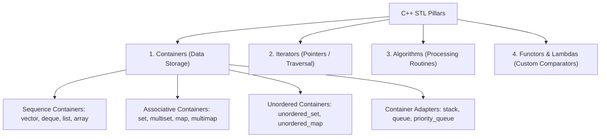

# 🧰 2 · Standard Template Library (STL)

### Modern C++ Generic Containers · Iterators · Standard Algorithms · Function Objects

*A structured space for mastering the C++ Standard Template Library, contrasting STL containers with custom from-scratch data structure implementations.*

---

## 📖 Overview

The **Standard Template Library (STL)** is a powerful suite of generic C++ template classes and algorithms providing off-the-shelf data structures and common algorithmic routines.

Learning philosophy in this repository:
> **Build it from scratch first $\to$ Understand internal memory and mechanics $\to$ Leverage the STL abstraction efficiently in production.**

---

## 🏛️ STL Architecture & Pillars

---

## 📦 Container Categories

### 1. Sequence Containers (Linear Collections)
- `std::vector`: Dynamic contiguous array with amortized $O(1)$ push-back and $O(1)$ random access.
- `std::array`: Fixed-size array with compile-time size and zero runtime overhead over C-arrays.
- `std::deque`: Double-ended queue allowing $O(1)$ insertion/deletion at both front and back.
- `std::list`: Doubly-linked list allowing $O(1)$ insertions/deletions anywhere given an iterator.
- `std::forward_list`: Singly-linked list optimized for minimal memory footprint.

### 2. Associative Containers (Sorted Binary Search Trees - Red-Black Trees)
- `std::set` / `std::multiset`: Unique / duplicate sorted elements with $O(\log n)$ search, insert, delete.
- `std::map` / `std::multimap`: Key-value pairs sorted by key with $O(\log n)$ search, insert, delete.

### 3. Unordered Containers (Hash Tables)
- `std::unordered_set` / `std::unordered_multiset`: Hash table based collection with average $O(1)$ lookup.
- `std::unordered_map` / `std::unordered_multimap`: Hash table based key-value store with average $O(1)$ lookup.

### 4. Container Adapters
- `std::stack`: LIFO adapter (defaults to `std::deque`).
- `std::queue`: FIFO adapter (defaults to `std::deque`).
- `std::priority_queue`: Heap-based adapter (defaults to Max-Heap on `std::vector`).

---

## 🔄 Custom Implementations vs STL Equivalents

| Manual Implementation in Repository | STL Equivalent | Internal Data Structure |
| :--- | :--- | :--- |
| [`02_arrayADT`](../1_data_structures_code/02_arrayADT/) | `std::vector<T>` | Contiguous dynamic heap array |
| `Singly / Doubly Linked List` *(Upcoming)* | `std::forward_list<T>` / `std::list<T>` | Linked nodes with pointers |
| `Stack ADT` *(Upcoming)* | `std::stack<T>` | Dynamic array / deque wrapper |
| `Queue ADT` *(Upcoming)* | `std::queue<T>` | Circular array / deque wrapper |
| `Binary Search Tree / AVL` *(Upcoming)* | `std::set<T>` / `std::map<K, V>` | Self-balancing Red-Black Tree |
| `Max / Min Heap` *(Upcoming)* | `std::priority_queue<T>` | Binary Heap array |
| `Chaining / Probing Hash Table` *(Upcoming)* | `std::unordered_map<K, V>` | Hash Table with bucket arrays |

---

## 🧮 Standard Algorithms Overview (`<algorithm>`)

- **Sorting**: `std::sort`, `std::stable_sort`, `std::partial_sort` ($O(n \log n)$ Introsort)
- **Searching**: `std::binary_search`, `std::lower_bound`, `std::upper_bound`, `std::equal_range` ($O(\log n)$)
- **Modifying**: `std::reverse`, `std::rotate`, `std::unique`, `std::transform`
- **Numeric (`<numeric>`)**: `std::accumulate`, `std::inner_product`, `std::iota`

---

## 🔗 Related Sections

- 🔙 [Root Repository README](../README.md)
- 🧱 [C++ Syntax Fundamentals](../0_syntax_codes/README.md)
- 🧮 [Data Structures & Algorithms](../1_data_structures_code/README.md)
- 📝 [C++ Language Notes](../notes/README.md)
